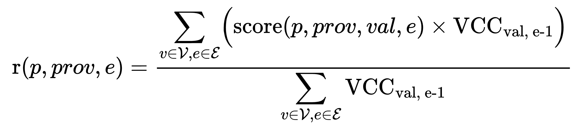

# FORESTAI WHITEPAPER ALPHA VERSION

## Table of Contents

> [**Abstract**](#abstract)

> [**Intro - Building an AI Innovation Engine**](#intro-building-an-ai-innovation-engine)

> **Part 1: Problem Framing**

>> [**Motivation for Accelerating AI Innovation**](#motivation-for-accelerating-ai-innovation)

>>> [Societal vs. Technological Innovation](#societal-vs-technological-innovation)

>>> [AI as the Highest-Impact Tech Innovation Frontier](#ai-as-the-highest-impact-tech-innovation-frontier)

>>[**Centralization Problem and AI's Susceptibility**](#centralization-problem-and-ais-susceptibility)

>>> [AI Building Blocks](#ai-building-blocks)

>>> [Implications for Businesses](#implications-for-businesses)

>>[**Roots of Innovation: Economic Theory and Historical Insights**](#roots-of-innovation-economic-theory-and-historical-insights)

>>[**Blockchain History Insights**](#blockchain-history-insights)

>>> [Mining Workloads That Follow The Market](#mining-workloads-that-follow-the-market)

>>> [Accelerating Innovation](#accelerating-innovation)

>>[**Addressing Industry Wide Overfitting of AI Models**](#addressing-industry-wide-overfitting-of-ai-models)

>>[**How ForestAI Leverages Insights to Drive Innovation**](#how-forestai-leverages-insights-to-drive-innovation)

>>> [Design Objectives](#design-objectives)

>>> [High-level Feature Set](#high-level-feature-set)

> **Part 2: Solution - ForestAI Network**

>> [**Network Actors**](#forestai-network)

>>> [Basic Flow of Value between Actors](#basic-flow-of-value-between-actors)

>> [**Tokenomics**](#tokenomics)

>>> [Flow and Use](#flow-and-use)

>>> [Token Burning](#token-burning)

>>> [Token Emissions](#token-emissions)

>> [**Validation**](#validation)

>>> [Validation Lifecycle](#validation-lifecycle)

>>> [Score Aggregation](#score-aggregation)

>>> [Validator Credibility Coefficient](#validator-credibility-coefficient)

>> [**Attack Vector Mitigation**](#attack-vector-mitigation)

>>> [Sybil Attack](#sybil-attack)

>>> [Validator Vote Copying](#validator-vote-copying)

>>> [Validator-Provider Collusion](#validator-provider-collusion)

>> [**Deterministic Innovation Funding**](#deterministic-innovation-funding)

>> [**Sample Use Cases**](#sample-use-cases)

>>> [Machine Translation [Text to Text]](#machine-translation-text-to-text)

>>> [Python Code Generation [Text to Text]](#python-code-generation-text-to-text)

>>> [Image Generation [Text to Image]](#image-generation-text-to-image)

>>> [Future Event Prediction [Text to Boolean]](#future-event-prediction-text-to-boolean)

>> [**Moat**](#moat)

>>> [Strong Network Effects](#strong-network-effects)

>[**References**](#references)

# Abstract

**ForestAI is an AI-focused innovation engine** leveraging positive learnings from **Bitcoin mining** and **preventing tokenomics pitfalls** that allow oligarchies of large token holders to control networks to their benefit **like in Bittensor**.

In ForestAI, **all offered services are available for purchase** by real-world clients on day one. This allows us to **move away from corruption-prone stake-weighted voting** and instead **distribute tokens based on verified blockchain data** on who attracts the most new customers to the network.

Furthermore we ensure fair competition by utilizing **cheat-proof decentralized AI benchmarking** in the reward function and **collateral** **slashing** for attempted cheating. 

To ensure **long-term economic viability** the network treasury **earns a commission** on revenue generated by participants.  

<a id="intro-building-an-ai-innovation-engine"></a>
# Intro - Building an AI Innovation Engine

Financially linked decentralized protocols like **Bitcoin** **have demonstrated the power** of blockchain technology **in coordinating vast networks of people and resources** toward **advancing a common goal**. However, while Bitcoin has revolutionized finance, **its scope remains narrow**. As **AI takes an increasingly dominant role in global economies**, redirecting resources on a scale comparable to Bitcoin’s — measured in hundreds of terawatt-hours per year — toward **solving a diverse range of AI challenges could reshape** not just finance but **the totality of our economic paradigm**.

We propose a novel **solution** that **rewards innovators based on tangible, measurable advancements in AI**, with **market-driven selection** and **valuation of AI challenges** based on **consumer purchasing choices** that dictate global token emissions. Within each specific challenge, **specialized validators** assess **performance of competing models** determining further allocation of rewards. This creates a cascading incentive system where **only AI solutions with real demand receive sustained funding**.

We believe such a radically open **system**, **steered by** indisputable **blockchain-verified monetary flows**, **free of legal overhead** and **cross-border bureaucracy**, **will accelerate the discovery** of valuable **AI problems** and the **pace of innovation itself**.

**This whitepaper presents ForestAI** as a solution harnessing crypto- and behavioral- economics, growth theory and computer science **to realign incentives in digital markets**, **transforming AI** development **from a centralized arms race into a decentralized innovation network**.

# Part 1: Problem Framing

# Motivation for Accelerating AI Innovation

Over the course of human existence, shaped by the constraints of omnipresent scarcity, the fundamental objective has always been the **maximization of survival and prosperity.** Two primary mechanisms have driven this process: **(1) societal- and (2) technological- innovation**.

## Societal vs. Technological Innovation

**Societal innovation** has led to new forms of **tribal organization, pan-tribal cooperation, governance structures, regulatory frameworks, moral norms, and institutional advancements**. For instance, the abolition of slavery and human rights frameworks redefined moral universality through legal and cultural shifts rather than technological breakthroughs. Representative democracies replaced autocratic regimes, reimagining power distribution and civic participation as collective values. Similarly, labor rights movements institutionalized minimal wages and workplace protections via unions, exemplifying systemic change through renegotiated social contracts. These "imagined orders"[^1], as Yuval Noah Harari describes them, including e.g. environmental regulations and currency systems, reshape cooperation by altering shared narratives and ethical norms.

However, **societal innovation appears to have plateaued**, **oscillating in a sinusoidal fashion between variations of past models** rather than charting entirely new directions. Even globalization, once seen as a major societal innovation \- rooted in the Ricardian Comparative Advantage Theory[^2] \- fueled by ever-expanding market size, is now retreating due to shifting geopolitical landscapes and demographic constraints in many parts of the world.

**In contrast, technological progress has been the true driver of transformative change**, continuously reshaping our world in profound ways. Hence we can observe a **shift** in our economy’s reliance on the **traditional Ricardian component of growth to the Schumpeterian “creative forces of destruction”** taking a leading role in ensuring continued progress. 

**Technological progress has already drastically improved human well-being.** For instance, average life expectancy has **risen from 32 to 71** over the past 100 years[^3], with deaths from infectious diseases **dropping by approx. 95%** from 1900 to 1996[^4] due to antibiotics, vaccines, and medical advancements. Similarly, literacy rates have soared **from just 10% to over 90%** in the last 200 years[^5]. The steam engine revolutionized industry, reducing agricultural labor from **95% to 25%[^6]** and catalyzing urbanization and modern economies. The advent of jet aircraft cut transatlantic travel **from 10 days to mere hours** in comparison to steamships[^7]. Each of these technological leaps was not just incremental progress but a radical transformation of economic and social structures. **Technological innovation**, therefore, very often serves as the **enabler** **of** **societal transformation** itself.

Moreover the overall **pace of innovation** **is** not only continuous but **demonstrably accelerating**. As Kurzweil’s Law of Accelerating Returns posits, **technological progress occurs exponentially, building upon itself at an ever-increasing rate**[^8]. This acceleration is particularly pertinent in today's digitally driven, interconnected world. 

## AI as the Highest-Impact Tech Innovation Frontier

**Artificial intelligence represents the next monumental leap in this accelerating curve.** AI is poised to transform not just individual industries but the very foundations of economic and social systems. 

Some of AI's breakthroughs already include:

* **Mastering complex strategy games like Go**[^9] where there are more possible board positions than there are atoms in the universe[^10].

* **Achieving breakthroughs in protein folding**, revolutionizing drug discovery \- AlphaFold 2 model accurately predicted the structure of nearly every known protein, solving a 50-year grand challenge[^11].

* **Beating human domain experts** in e.g. Clinical Text Summarization[^12] or Legal Contracts Review tasks[^13]

And while most technology advancement is restricted in its impact to a few specific industries, **AI is poised to impact virtually every aspect of our economy.**

With global **AI investment** projected to reach **$200 billion by 2025**[^14] and AI expected to **contribute $15.7 trillion to the global economy** by 2030[^15], its influence will extend from macroeconomic growth to granular operational efficiencies. Goldman Sachs Research estimates AI could **boost** global labor **productivity by over 1% annually** in the decade following widespread adoption, with **U.S. AI-related investment peaking at 2.5–4% of GDP**.

# Centralization Problem and AI's Susceptibility

However this Cambrian explosion of **AI-driven innovation paradoxically unfolds under the shadow of an emerging oligopoly**, a wider problem thwarting the whole digital space.

## AI Building Blocks

Some of the crucial components for AI’s development \- **hardware accelerators, cloud infrastructure, human resources and IP** \- are controlled by merely a handful of players. 

**In cloud infrastructure**, as of the first quarter of 2024, the market is overwhelmingly dominated by three major players[^16]:

* **Amazon Web Services** (AWS): Holds **31%** of the market share. According to estimates from Synergy Research Group, AWS remains the leading provider in the worldwide cloud infrastructure market. 

* **Microsoft Azure**: Achieved an all-time high market share of **25%** in Q1 2024, continuing its rapid growth trajectory. 

* **Google Cloud Platform** (GCP): Maintains an **11%** market share, solidifying its position as the third-largest provider. 

Collectively, these "Big Three" now account for **67%** of the ever-growing cloud market, with the rest of the competition stuck in the low single digits. **Their control continues to expand as they invest in additional physical infrastructure, such as international internet cabling**[^17]. Furthermore, in 2023, the top five Infrastructure as a Service (IaaS) providers accounted for **82%** of the market, further consolidating their dominance[^18].

Despite there being over **9,000 data centers worldwide** as of 2023[^19] [^20], **the market share of providers outside the top seven has been historically decreasing**—from **48.4%** in 2015 to **18.9%** in 2022[^21]. This decline highlights the immense challenges smaller cloud providers face when competing against industry giants, leading to reduced diversity and stifled innovation in the market.

In hardware acceleration, **Nvidia has a market share between 70-95%**[^22]. Morgan Stanley estimates Nvidia’s share in **wafer allocation will grow to 77% in 2025[^23]**. They also integrate vertically with their **CUDA exosystem** remaining the **de facto standard for GPU programming**, integrated in major AI frameworks like PyTorch and TensorFlow.

**On the other hand the IP** over most powerful large language models (LLMs) is controlled by companies like OpenAI, Anthropic, Meta, Google, DeepSeek, and Mistral[^24]. While some companies, such as Meta and Google, open-source parts of their research, especially the **training datasets remain proprietary**, limiting broader innovation. A similar dynamics can be observed for nonLLM models as well. 

**The reason** for this phenomenon being AI’s **reliance on vast datasets, computational resources, and proprietary models**—assets predominantly concentrated within a few dominant technology corporations. Unlike traditional software, **AI development benefits disproportionately from economies of scale**, where greater access to data and compute leads to self-reinforcing advantages in model performance and efficiency. 

The **risk of centralized IP** control is further highlighted by the fact that roughly **70% of new AI PhDs now join industry** (compared to 20% two decades ago)​[^25] where a significant portion of their work remains close-sourced. 

Additionally, **regulatory and ethical considerations** surrounding AI **further consolidate power**, as only well-capitalized entities can navigate compliance requirements while shaping policy to their advantage. **Without deliberate decentralization efforts, AI risks becoming an entrenched oligopoly,** stifling innovation and limiting the equitable distribution of its benefits.

## Implications for Businesses 

This centralization in the cloud and in the AI space comes at a cost for businesses and users. The major ones being:

* **Vendor Lock-In and High Costs:** The dominance of a few providers exacerbates vendor lock-in issues. Migrating away from these providers is complex and costly due to proprietary technologies and contracts, trapping businesses in long-term commitments. With limited competition, there's less pressure on these providers to offer competitive pricing, making services expensive for businesses, especially startups and SMEs.

* **Managing Cloud Spend**: **82%** of all organizations find cloud spending to be their main challenge, ahead of security (79%) and lack of resources or expertise (78%) [^26]. The pricing power of the dominant providers contributes significantly to this challenge.

* **Complex Multi-Cloud Environments**: Recognizing the risks of over-reliance on a single provider, **89%** of businesses report investing in multi-cloud solutions[^27]. However, managing multiple providers adds complexity and operational overhead.

Furthermore lack of diverse offerings can hinder businesses from finding solutions that perfectly fit their needs and also exposes them to risks of:

* **Single Points of Failure**: Centralization increases the risk of widespread outages. When one provider experiences issues, it can affect a significant portion of services, disrupting businesses and consumers alike.

* **Reduced Negotiation Power**: Businesses have less leverage to negotiate better terms, service level agreements, or pricing, which can impact their operational efficiency and bottom line.

* **Data Sovereignty and Security Concerns**: Centralized control raises concerns about data sovereignty, privacy, and compliance with regional regulations. It also makes cloud services attractive targets for cyberattacks, posing economic and security risks.

This shows how centralization can impact business and why the artificial intelligence industry in general is uniquely vulnerable to monopolistic control. 

# Roots of Innovation: Economic Theory and Historical Insights

Monopolistic markets historically have a **dampening effect on technological progress**, creating a tension well-documented in innovation economics​[^28]. While dominant firms have the resources to fund research and development (R\&D), they often face conflicting incentives—major breakthroughs can threaten their own entrenched business models. This phenomenon, sometimes called **Captured Innovation**, describes how industry leaders sustain incremental improvements but stifle disruptive advances that could undermine their dominance[^29].

A clear historical example is **AT\&T’s Bell Labs**. In 1947, Bell Labs invented the **transistor**, a breakthrough that could have catalyzed computing decades earlier. However, as a monopoly, AT\&T had little incentive to widely commercialize the technology. Only in 1956, under **antitrust pressure**, was it forced to **license its patents on fair terms**. The result was an explosion in semiconductor development, which, according to economists, had a greater impact on global economic growth than even the **Marshall Plan**[^30].

Similar patterns appear in **Big Tech today**. As a handful of firms consolidate control over data, computational resources, and AI models, concerns grow that they will limit AI progress to sustain their dominance. Some economists, such as **Yanis Varoufakis**, even **claim that we have entered a Techno-Feudalism** phase where dominant firms no longer function as competitive capitalists but as rent-seeking lords controlling digital fiefdoms[^31]. 

This aligns with a morbid vision of Schumpeter’s[^32] who claimed that:

* **in the early stages of capitalism, creative destruction dominates**—entrepreneurs disrupt incumbents, creating waves of innovation, 

* but **in the mature stage, firms that survive creative destruction use their market position**, economies of scale, and political influence **to slow down disruption**, leading to corporatism.

Economists like **Luigi Zingales** and **Thomas Philippon** argue that modern capitalism has already seen a significant **decline in competition**, leading to reduced productivity growth despite technological advances. All because of corporate and political entrenchment, regulatory capture, and high market concentration[^33]. This supports Schumpeter’s prediction on the inevitability of corporatism.  

**While Schumpeter acknowledged that oligopolies could foster technological progress** due to their resources and ability to invest in long-term transformative projects, **he was also concerned that this shift might lead to bureaucratization** and a decline in the entrepreneurial spirit.

A similar dynamic plays out in the public-sector. On the one hand public-sector has historically played a role in supporting early-stage, high-risk technologies. **Mariana Mazzucato**  highlights how agencies such as **DARPA, NIH, and NASA** have driven foundational breakthroughs in computing, medicine, and aerospace by **de-risking radical innovation[^34]**. On the other hand, state-driven innovation often suffers from **bureaucratic inefficiencies, slow decision-making, and lack of transparency**. 

Another idea worth noting is the **open innovation ecosystems[^35]** that builds on **Hayek’s theory of distributed knowledge[^36]**, which argues that decentralized decision-making fosters innovation by utilizing diverse information sources. Similarly, **Von Hippel’s work on user-driven innovation** shows that many **technological breakthroughs originate** not from corporate R\&D labs but **from independent researchers, startups, and early adopters**[^37].

Economic theory seemingly arrives at a conclusion that neither extreme concentration nor excessive fragmentation fosters optimal innovation. This is effectively captured by **Aghion & Howitt** who propose the **"inverted-U" hypothesis[^38]**, where:

* **Too much concentration** leads to **rent-seeking behavior and stagnation**, as seen in Big Tech.

* **Excessive competition** limits firms’ ability to **invest in high-risk, long-term R\&D**.

* **An intermediate level of competition** fosters **continuous, high-impact innovation**.

Additionally an important aspect seems to be knowledge **spillovers, human capital accumulation** and **open access to information**.

**Behavioral economics** provides even more insights on the micro level into how to create a self-sustaining innovation engine. The works by **Tversky & Kahneman** show that individuals exhibit a number of cognitive biases**[^39].** If addressed can improve the outcomes and expedite adoption. 

# Blockchain History Insights 

Similarly it’s worthwhile drawing **insights from the history of blockchain projects** \- most notably those that were **successful at coordinating** massive amounts of **computational power**, those that pioneered **crypto economic incentivization** and those that pioneered **AI acceleration**.

## Mining Workloads That Follow The Market

**Mining rewards have been the core incentivization component** of the blockchain crypto economic systems. 

However, since the beginning, there have been **two fundamentally connected problems**. One being that the **workloads themselves often weren’t very useful**. They were a throw-away computation with the utility of aligning the miner with the ecosystem by making the miner incur a cost that could only be offset by the income from rewards if those rewards had value. The second part of the problem was that if the computation wasn’t very useful but computationally expensive then all that **energy was considered wasted** by a significant part of the community. 

That’s why a **search for better solutions** began. Some of the researchers went into another direction of designing systems where the alignment between participants securing the network was ensured in a different way e.g. by **providing a stake**. While the others tried changing Proof-of-Work algorithms to function based on **more useful workload**s. 

The progress on the second approach can be described by defining three generations of workloads: 

**1st Gen**: Bitcoin mining is just a competition for who can randomly guess the right numbers to hash together and hence seen as a significant waste of energy. Bitcoin consumes a comparable amount of energy as Poland[^40] (21th biggest world economy).

**2nd Gen**: Projects like LivePeer[^41], FileCoin[^42] or Render Network[^43] that give mining rewards for workloads that have real world utility, but they define that utility, as well as the results validation process, in a narrow way with rigid smartcontracts making it hard for the networks to adapt to a changing market. Both FileCoin and LivePeer struggled for instance with Miners gaming the system to receive the rewards for empty work.

and the current state-of-art:

**3rd Gen**: Open marketplace for competing workloads where rewards are dynamically adjusted to benefit mining and validating those that have the most utility to the market. 

## Accelerating Innovation

**A notable example of 3rd Gen Mining** with a mission to accelerate innovation **is Bittensor**. It launched in 2021 and established a decentralized network focused on improving AI by subsidizing innovation with its TAO token. While groundbreaking, especially in the flexibility of the validation process with its subnet system, **Bittensor faces significant challenges** that expose fundamental flaws in its design.

A critical deficiency is the **absence of an in-protocol purchase mechanism** for end-users to easily get access to the products and services generated within the Bittensor ecosystem. The initial assumption that independent teams would build separate marketplaces for each subnet has not materialized, leaving a significant gap between the network's output and potential consumers. Miners who create the products know that and that’s why they optimize for playing the emission game rather than truly innovating. Additionally this lack of direct monetization creates a system where the TAO token's value relies primarily on attracting new participants (miners, validators, token investors), rather than on genuine demand for the AI services produced. **This means that the alleged innovation is subsidized by TAO token buyers and is not sustainable in the long run.**

Furthermore, the **power dynamics within Bittensor are severely imbalanced**. Miners and Subnet Owners are vulnerable to extortion by validators, as validators control the distribution of token rewards. Within the validator group itself, the control is skewed towards the largest players: only top validators with substantial stakes have significant influence over subnet emissions, leading miners to prioritize these validators and effectively disenfranchise smaller validators **effectively creating an oligopoly of large validators over the whole system.**

Additionally what exacerbates the fundamental validator-miner imbalance is:

* that Validators are not required to pay miners for servicing their requests. The **lack of interaction costs** also leads to DDoS and Sybil attacks between miners, as there are no effective economic disincentives to prevent such malicious behavior,   
* Validators have multiple avenues for monetization (emissions and monetizing miner’s work) while miners rely solely on emissions,  
* Validators receive similar emissions to miners while performing significantly less complex work and without directly compensating miners for their services.

Some of that could be solved by allowing for variable validators-miners split, yet these are fixed at 41% each with the remaining 18% going to the Subnet Owner. It’s clear that **fixed and rigid subnet rules** like this further hinder Bittensor's adaptability. **Different subnets**, with their varying dynamics and actor responsibilities, **are** **ill-served by a one-size-fits-all emissions structure.** 

Rigidness of the system is also shown with its myopic focus on **optimizing solely for performance metrics**, as judged by validators, neglects the crucial role of price-to-performance ratios and other real-world considerations that drive consumer choices. 

It’s also worth noting that Bittensor still **hasn’t implemented** an effective negative reinforcement like **slashing** to deter malicious or suboptimal behavior.

The ***decision to operate its own blockchain*** introduces **unnecessary overhead** and complexity without providing a clear advantage over utilizing existing, more established blockchain platforms. Actually it makes it **less interoperable with the wider blockchain ecosystem**.

Finally, the capped emission schedule, coupled with the absence of direct payment for services, creates an **unsustainable long-term economic model**. As emissions decrease, **miners**, who bear the primary computational costs, **will inevitably leave the network** when rewards no longer cover their expenses. 

The recent **dTao upgrade** was marketed as solving some of the problems with the oligopoly and collusion but unfortunately in our view as well as early insights from within the Bittensor ecosystem this turns out to be a move that **adds complexity to the system** but **doesn’t solve the core issues Bittensor faces**. The main reason being that any form of **staking which in its nature is a financial and speculative task**, **can’t be a good metric** of real world utility of real tech products. **Only real customers using and most importantly paying for these products can be an effective judge of their value.**

# Addressing Industry Wide Overfitting of AI Models

Another very important piece of context in accelerating AI innovation is **Model Overfitting plaguing the AI industry**.

Public benchmark test data sets make AI model performance comparable. But this creates an incentivization for closed source models in particular to game the benchmarks by creating heuristics for them or overfitting their training data to include solutions to the known testsets. This phenomenon is well described by Vitalik who states that “in cryptography, open source is the only way to make something truly secure, but in AI, a model (or even its training data) being open greatly increases its vulnerability to adversarial machine learning attacks”[^44].

For open source models **Dynabench**[^45] tries to solve the problem of overfitting on test datasets with a community of humans **intentionally creating new test data designed to be hard for models**. But Dynabench only works with open source models. Additionally Dynabench has not seen significant adoption even after being managed by mlCommons. We believe this lack of traction is due to a lack of incentives for evaluators or AI model owners to participate. 

**Centralized private test data evaluation** is another approach that has been attempted to resolve the problem of AI companies gaming benchmark results. One currently active private evaluator is the SEAL LLM Leaderboards[^46] by Scale.ai[^47]. However, this lacks the transparency and audibility to be fully trustworthy and widely used as a standard. 

**Decentralised systems are strongly positioned to solve** all of those issues thanks to providing proper incentivization to all parties involved while leveraging blockchains' decentralization and transparency. **Private datasets** still can be a fundamental **part of the validation strategy**. Especially given current **advancement in privacy technologies like TEEs, ZKPs and FHE**.

# How ForestAI Leverages Insights to Drive Innovation

After analysing the problem of accelerating AI innovation from all those angles there are a number of insights that can be summarised as below:

* technological innovation is what drives humanity forward,  
* AI is the highest impact tech on the market and in the foreseeable future,  
* history and economic theory show monopolies and centralization can hinder innovation so they must be avoided, however sustained and large-scale funding is crucial to derisking the innovation game for entrepreneurs,  
* another learning from economic theory is that maximizing knowledge spillovers is the root of the process, that’s why transparency and interoperability is paramount,  
* studying blockchains, even though they are nascent technologies in the grand scheme of things, shows how proper incentivization of actors, flexibility and adaptability, oligopoly deterrence and proper validation by the market using monetary flows are all required of a sustainable and effective system,  
* for AI focused systems model validation is an inseparable part of the equation and new cryptographic techniques should be incorporated to create a robust solution.

## Design Objectives

These insights can be applied to optimize outcomes. That’s why **ForestAI’s design objectives and guiding principles optimise towards**:

1. **discovering valuable problems to solve** to efficiently allocate capital,  
2. **derisking the innovation game** so that Providers (incl. researches and budding entrepreneurs) can quickly get access to sustained funding if their service offers high quality,  
3. **aligning the incentives** for Service Providers and Validators to work for Network’s well-being and growth rather than only their self-interest,  
4. **derisking system use** from the User’s perspective not to have fear stop engagement with innovation,  
5. **providing transparency** to foster cooperation, knowledge spillovers, and accelerate entrepreneurial cycle with quicker feedback loops,  
6. **having a decentralised governance layer** to steer the direction and ensure system’s adaptability,  
7. **mitigating cognitive biases** to ensure more rational decision making,  
8. **fostering healthy competition** to find a balance between the unproductive extremes,  
9. **mitigating collusion between system’s Actors** to build a resilient and sustainable system,  
10. **leveraging interoperability** to take advantage of network effects of leading ecosystems,
11. **promoting synergy** between ForestAI-based ecosystem solutions.

## High-level Feature Set

ForestAI’s high level feature set that addresses those points includes:

* **ForestAI token**,   
* **Fair Validation**,  
* **In-built Marketplace**,  
* **Emission Target Discovery**,  
* **Staking and Slashing,**  
* **Highly Flexible Network- and Protocol- level Parametrization**,   
* **Decentralised Blockchain-based Design**,  
* **DAO Governance,**  
* **EVM-first Design**.

By integrating **historical insights, radical transparency, behavioral incentives, and decentralized governance**, ForestAI creates a **blueprint for continuous AI-driven progress**. Its structure:

* **Eliminates monopoly-driven bottlenecks in AI innovation**.

* **Establishes a sustainable funding model based on transparent, market-driven signals**.

* **Maintains competition and structural dynamism, ensuring long-term technological progress**.

Quoting an economist whose ideas we referred to at the beginning of this paper, **Schumpeter famously said**, when accused of being an anti-capitalist given his prediction that capitalism will fail: *“**if a doctor predicts that his patient will die presently, this does not mean that he desires it**".* We believe that blockchain-based systems, with their transparency, decentralised governance and effective crypto economics **are the cure that Schumpeter knew capitalism needed** but in his time wasn’t there. 

**The cure is here \- ForestAI Network.**

<a id="forestai-network"></a>
# Part 2: Solution - ForestAI Network

ForestAI Network is an **interoperable collective of incentivised Protocols**, each solving a specific AI challenge with Providers offering solutions to Customers and Validators ensuring quality. **These Protocols are living organisms** that are created, managed and maintained by entities with specific roles who perform specific actions. **There are five distinct types of Actors** in the system.

# Network Actors

**Protocol Owners** (aka PTO): Define Protocols goals, rules, parameters and hyperparameters.

**Customers** (aka Users): Purchase AI services from Providers and influence token rewards. They get a wide & comparable offering from competing Providers, better prices, full transparency on Provider's past performance, unified interfaces and customer protection programme which mitigates the risk for trying out unknown Providers.

**Providers**: Compete to offer the best AI services. They receive USDC (later option for FOREST payments) from Customers for the Service they provide and FOREST from the Network proportional to their performance as judged by the Validators. Providers benefit from a new powerful distribution channel and rewards for innovating on valuable challenges. 

**Validators**: Evaluate Providers' performance, ensure cross-compatibility, aggregate the results and rank all Providers in a specific Protocol to find the best innovators. The ranks get written to the ForestAI smartcontracts. For their work Validators get rewarded in FOREST.

**ForestAI DAO:** community of FOREST token holders that actively participate in shaping the ForestAI Network by discussing, proposing, voting and implementing changes.

related terms:

**Protocols**: Standardize competition for an AI task. Define unified API for Providers and quality evaluation criteria for Validators.

**Root Contracts**: A set of ForestAI smartcontracts that govern on-chain network rules including Actor and Offer registrations, User-Provider Agreement accounting and billing, Validator rank submission and processing, as well as creation and distribution of FOREST tokens to Protocols and their Actors based on their customer revenue and performance.

**Offer:** A proposal from a Provider to a potential Customer with details on terms and conditions of a Service or Resource that a Provider is able to deliver to a Customer should the Customer decide to enter an Agreement with the Provider.

**Service / Resource:** What is being offered to a Customer by a Provider. An instance of an Offer.

**Agreement:** An object that holds information on the commitment between Provider and Customer and related billing information. Provider promises to the Customer access to a Service or a Resource on terms specified within a connected Offer. Customer promises the Provider a payment. The promises are enforced on-chain meaning that there is no element of trust needed between Parties.

## Basic Flow of Value between Actors


# Tokenomics

## Flow and Use 

FOREST token is an integral part of the incentivisation layer required for the system to be robust as it implements both positive reinforcement (reward) and negative reinforcement (punishment). It serves six distinct use cases:

**A\. rewards for participating Actors**

Rewarding positive behaviour that progresses the goals of the ForestAI Network with tokens aligns Actors’ interests with the Network’s interests. ForestAI rewards:

- Protocols for solving valuable challenges  
- Providers for having high performance  
- Validators for truthful and consistent completion of Provider validations

**B\. payment for Services**

ForestAI allows for two tokens to be used as means of payment for the Services: USDC stablecoin and FOREST native token.

In the first phase USDC will be used primarily. The decision is dictated based on the following:

- Customers need to have an easy way to onboard and naturally USDC is one of the easiest cryptocurrencies to acquire.    
- Since Provider operations come with recurrent costs in forms of payroll to employees, energy costs, infrastructure expenses and others, Providers need to have as much stability and predictability on the income for the Services they provide.

However as the ForestAI ecosystem matures, and the FOREST token gains wider adoption, exchange recognition and most importantly high liquidity that will translate to lower volatility, the DAO plans to enable FOREST token payments as well. This will allow users to pay lower network fees for entering into agreements just like using native token on exchanges lowers transaction fees. Providers on the other hand will be able to charge higher fees as there will be smaller to no network commission on those deals.

**C\. payment for Actor registration**

Protocol Owners, Validators and Providers are required to pay registration fees upon joining the Network and creating or joining distinct Protocols. 

This serves two primary goals:

* Sybil Deterrence

  More participants in the Network comes with increased workloads. By putting a cost to joining the Network we make a variety of attacks economically unviable thereby protecting the Network from malicious actors.

* ForestAI Treasury Funding

  ForestAI Network will go through numerous cycles of improvements. That’s why there needs to be a Treasury established that will fund operations and growth. Apart from getting part of the registration fees, the Treasury will have its share in the revenue generated by Protocols.

**D\. collateral for Validators and Providers**

One of blockchain’s main value propositions that allowed for the trustless trust revolution is accountability of its actors. Similarly, for the ForestAI Network to be balanced we need not only a carrot (rewards for good behaviour) but also a stick (punishment for bad behaviour). To enforce a possibility for a punishment, a well tested method in decentralized and pseudo anonymous systems is the concept of collateral slashing.

In ForestAI, Validators and Providers stake collateral in ForestAI smartcontracts that can be slashed if: a) a Provider after getting ranked by Validators is deemed to provide Services of quality not meeting minimum requirements of a Protocol b) a Validator repeatedly reports wrong ranks and by doing so distorts the quality of the Provider validation process.

The slashed amount gets redistributed to affected users thereby creating a de facto customer protection programme that reimburses those that suffered because of Provider’s or Validator’s wrongdoing.

This collateral is staked in FOREST token which naturally increases demand for the token while decreasing the float. Part of the redistribution amount flows to the ForestAI Treasury.

**E\. voting weights for DAO participants**

The system needs to be adaptable to the changing market conditions. That's why ForestAI is governed by a set of parametrizable variables that can be changed to adjust the outcomes.

Both this parametrization as well as control over ForestAI Treasury and roadmap will be ultimately in the hands of the ForestAI DAO. The weights of individual votes will be based on the amount of FOREST tokens in posession of the owner.

**F\. staking to Protocols**

While the majority of the token emissions will always be governed by on-chain revenue data, a component of the newly minted tokens can be directed to Protocols with user stake. This can function as an extention of the DAO where the token holders vote on what innovation to fund. This allows for nascent technologies that might be early on in their monetization roadmap to get sustained funding.

The diagram below shows the tokenomics related flows and actions:


## Token Burning 

Whenever there is a transaction that transfers ForestAI tokens to the ForestAI Treasury, part of the token amount is burned. The ratio of burned tokens is an adjustable smartcontract parameter that will be governed by the ForestAI DAO. In this way the Network can have a more fine-tuned control over the inflation rate of the token supply.


## Token Emissions

### Simplified View
The below example is simplified for illustrative purposes and doesn't take into account anti-sybil Shannon Entropy measures.

1. Each Epoch a number of tokens are generated

2. Each Protocol gets tokens proportional to its share of total Network Revenue

3. Each Provider in a Protocol gets tokens proportionally to AI performance score (rank)

4. Each Validator in a Protocol gets tokens according to its consensus score

The cascading nature of the emissions are visualised below:


### Token Inflation and Max Cap
FOREST token follows Bitcoin emission dynamics with one important adjustment. In Bitcoin rewards are emitted with every block, 10 min on average, while in FOREST tokens are emitted once per Epoch. The Epoch lasts a week. That means that the emission amount needs to be adjusted for the difference in the emissions interval. However other characteristic of Bitcoin emissions are kept, namely:

* Max Supply of 21 million coins  
* Halving Cycles occurring once every 4 years

Therefore the modified supply formula is a follows:


### Formal Definition of Protocol-level Emission Calculations

The ForestAI network distributes token emissions based on Protocol Revenue and Average User Shannon Entropy. Here's how the emissions $E_{p,e}$ for protocol $p$ in epoch $e$ are calculated:

#### 1. User Shannon Entropy ($H_{u,e}$):
For user $u$ in epoch $e$, let $A_{u,e}$ be their set of agreements, where each agreement $a$ has value $w_a$ for pair $(p_a, v_a)$.  
​
Let $S_{u,e}=\{(p_a, v_a) | a \in A_{u.e}\}$ be the set of unique pairs interacted with.

Total value for user $u$:
<!--
$$
W_{u,e}^{\mathrm{total}} = \sum_{a \in \mathcal{A}_{u,e}} w_a
$$
--> 


Value for user $u$ on pair $(i,j)\in S_{u,e}$:
<!-- latex formula
$$
W_{u,e}^{(i,j)} = \sum_{a \in \mathcal{A}_{u,e} \text{ s.t. } (p_a, v_a)=(i,j)} w_a
$$
--> 


Normalized proportion for pair $(i,j)$:
<!--
$$
P_{u,e}^{(i,j)} = \frac{W_{u,e}^{(i,j)}}{W_{u,e}^{\mathrm{total}}} \quad (\text{if } W_{u,e}^{\mathrm{total}} > 0, \text{ else } 0)
$$
--> 


Shannon entropy for user $u$:
<!--
$$
H_{u,e} = - \sum_{(i, j) \in S_{u,e} \text{ s.t. } P_{u,e}^{(i,j)} > 0} P_{u,e}^{(i,j)} \log_2 P_{u,e}^{(i,j)}
$$
--> 


If $W_{u,e}^{\mathrm{total}} = 0$, then $H_{u,e} = 0$.

#### 2. Average Protocol Shannon Entropy ($\bar{H}_{p,e}$):
Let $U_{p,e}$ be the set of users interacting with protocol $p$ in epoch $e$.
<!--
$$
\bar{H}_{p,e} = \begin{cases}
    \frac{\sum_{u \in U_{p,e}} H_{u,e}}{|U_{p,e}|} & \text{if } |U_{p,e}| > 0 \\
    0 & \text{if } |U_{p,e}| = 0
\end{cases}
$$
--> 


#### 3. Protocol Revenue ($R_{p,e}$):
Total revenue generated by protocol $p$ in epoch $e$:
<!--
$$
R_{p,e} = \sum_{u} \sum_{a \in \mathcal{A}_{u,e} \text{ s.t. } p_a = p} w_a
$$
--> 


#### 4. Weighted Contribution ($WC_{p,e}$):
The contribution of protocol $p$ is weighted by revenue and average user entropy:

<!--
$$
WC_{p,e} = R_{p,e} \times \bar{H}_{p,e}
$$
--> 


#### 5. Emission Distribution ($E_{p,e}$):
Let $E_{e}^{\mathrm{total}}$ be the total emissions for epoch $e$, and $P$ be the set of all protocols.
Total weighted contribution in epoch $e$:
<!--
$$
WC_{e}^{\mathrm{total}} = \sum_{p' \in \mathcal{P}} WC_{p',e}
$$
--> 


Emissions awarded to protocol $p$ in epoch $e$:
<!--
$$
E_{p,e} = \begin{cases}
    E_{e}^{\mathrm{total}} \times \frac{WC_{p,e}}{WC_{e}^{\mathrm{total}}} & \text{if } WC_{e}^{\mathrm{total}} > 0 \\
    0 & \text{if } WC_{e}^{\mathrm{total}} = 0
\end{cases}
$$
--> 


### Formal Definition of In-Protocol Emission Calculations
Formalised in next sections.

# Validation

Validation is a core pillar of the ForestAI Network, ensuring that AI-based services (Offers) submitted by Providers meet protocol-specific quality standards. To accomplish this, ForestAI Network defines a **Validator Daemon Template**, which Protocol Owners customize for their unique validation requirements. All Validators within a Protocol run an instance of this daemon. Below is an overview of the validation-related components and workflow.

## Validation Lifecycle

1. **Enter Agreement**  
   * Once an Offer is flagged for testing (immediately after registration, at random intervals, or both), the Validator Daemon must engage as a pseudonymous Customer and initiate an Agreement by invoking the Protocol’s smartcontract.  
   * This action establishes a binding arrangement with the Provider, granting the Validator the right to test the Offer.  
2. **Perform Validation Tests**  
   The daemon fetches the Offer details from both the smartcontract and, if needed, directly from the Provider.  
   * Depending on the configured test types, the daemon runs one or more of the following:  
     * **Automated Performance Tests:** Results that are direct performance measurements (e.g., response time in milliseconds).  
     * **Tests with Ground Truths**  
       1. Suitable when a dataset of known inputs and outputs is available (e.g., classification tasks).  
       2. The Validator compares the Provider’s output to known “correct” answers, calculates accuracy or error scores, and aggregates a final numeric rating.  
     * **Tests with Human Evaluation**  
       1. Used when subjective quality or creativity cannot be measured against a fixed answer key.  
       2. Human evaluators score or classify outputs based on guidelines, and the Validator aggregates these human-provided judgments.  
   * Test results, whether numerical metrics or human-assigned scores, are stored for later upload.  
3. **Score Aggregation**  
   * Raw results from each test are merged into a single ProviderScore struct:  
     ```
     struct ProviderScore {  
         uint24 provId;  
         int16 score;  
         uint32 agreementId;  
     }
     ```  
   * This struct captures the Provider ID, an aggregated score, and the agreement ID established in the previous step.  
4. **Commit Phase (Voting Window)**  
   * The daemon computes and submits a hash of the results to the ForestSlasher smartcontract with a commit() transaction, ensuring the Validator’s scores are “locked in” without revealing them publicly yet.  
5. **Reveal Phase (Reveal Window)**  
   * After the epoch closes and the reveal window opens, the Validator must call reveal() on the ForestSlasher contract, passing in the same hash along with the original ProviderScore array.  
   * This completes the commit-reveal cycle, making the validated scores visible on-chain for further processing such as consensus or reward distribution.  
6. **Raw Results Publication**  
   * Although on-chain scores are publicly accessible, the detailed raw results must also be published to a public storage location. This transparency ensures that anyone can audit how each aggregated score was derived.

The exact validation process is designed by the Protocol Owner who has the domain-specific know-how and is incentivised to produce the best Protocol. That’s because the better the Protocol, the more revenue it generates. The more revenue, the higher token emissions for this Protocol which translate directly to a payout for the Owner.

## Score Aggregation

Individual scores, where a Validator tests an individual Offer from a Provider, after they have been revealed, get aggregated into Ranks during the process of closing an Epoch. Each Provider gets assigned a Rank for each of the Protocols it takes part in for each of the processed Epochs.

To calculate a Provider's final rank in Protocol $p$, we take the weighted average of all score results. The weights are the Validator Credibility Coefficients (VCC).

<!-- 
$$
\text{r}(p, prov, e) 
  = \frac{\displaystyle\sum_{v \in \mathcal{V}, e \in \mathcal{E}}  \Bigl(\text{score}(p, prov, val, e)\times \text{VCC}_\text{val, e-1}\Bigr)}
         {\displaystyle\sum_{v \in \mathcal{V}, e \in \mathcal{E}} \text{VCC}_\text{val, e-1}}
$$
-->



where:

- **$p$**  
  The protocol identifier
- **$prov$**  
  The provider whose rank we want to calculate
- **$val$**  
  The validator identifier
- **$e$**  
  The epoch end block number
- **$\text{score}(p, prov, val, e)$**  
  The individual score assigned by Validator $val$ to the Provider $prov$ in Protocol $p$ for epoch $e$
- **$\mathcal{V}$**  
  The set of validator IDs participating in Protocol $p$
- **$\mathcal{E}$**  
  The set of closed epoch block numbers
- **$\text{VCC}_\text{val}$**  
  The Validator Credibility Coefficient of Validator $val$
- **$\text{r}(p, prov, e)$**  
  The final aggregated Rank (a weighted average) of the Provider $prov$ in Protocol $p$ for epoch $e$

If the Provider Rank is a positive number then the Provider takes part in the rewards distribution. If it's a negative number then the Provider gets slashed. 

<!-- latex fomula 
$$
\text{Emissions}(r, p, e) =
\begin{cases}
  \displaystyle
  \frac{\text{EmissionAmount}_\text{p, e} \cdot r}{\sum_{i=1}^{N_\text{p, e}} r_\text{e,i}},
    & \text{if } r \ge 0,\\[6pt]
  r \cdot \text{MaxPunishment}_\text{p},
    & \text{if } r < 0.
\end{cases}
$$
-->


where:
- **$r$**  
  The final Rank of a Provider
- **$p$**  
  The protocol identifier
- **$e$**  
  The epoch end block number
- **$\text{EmissionAmount}_\text{p, e}$**  
  The emission amount specific to Protocol $p$ in epoch $e$
- **$\text{MaxPunishment}_\text{p}$**  
  The maximum punishment specific to Protocol $p$  
- **$N_\text{pt, e}$**  
  The total number of ranks for Protocol $p$ in epoch $e$
- **$\displaystyle \sum_{i=1}^{N_\text{pt, e}} r_i$**  
  The sum of all ranks $r_i$ in Protocol $p$ in epoch $e$

## Validator Credibility Coefficient

The details will be published in a separate paper. The method for calculating the Coefficients will be similar to Yuma consensus vTrust calculations with tweaks that will allow for improved validation quality.

# Attack Vector Mitigation

## Sybil Attack 

Providers may try to cheat the token reward mechanism by creating many fake accounts and buying from themselves cycling the money. Multiple robust anti-sybil mechanisms are utilized to deter these types of attacks. However, even in the event of anti-sybil mechanisms absence, a sybil attack like this would not be immediately harmful for the Network for the following reasons:

* Every purchase has a significant network fee that goes to the Treasury

* The Network's total value locked (TVL) increases because Customers must pre-purchase at least a full month and Providers can not immediately withdraw

* The customer revenue brought in by one Provider does not only increase rewards for the particular Provider but also for other Providers on the same Protocol with a high performance score

* Token rewards have a lockup period

In order for an attacker to benefit from a sybil attack they would need to: a) dedicate a significant amount of capital to the attack (minimum staking requirements, fees and prepayments), b) have the capabilities to run a high scoring AI model in their Protocol and c) accept the risk that their rewards and stake can get slashed during the lockup period if they are found to have been running a sybil farm.

Sybil detection methods may include:

* [FIP24](https://github.com/Forest-Protocols/forest-AI/discussions/24) **Off-chain Verifiable Identifiers**

* [FIP27](https://github.com/Forest-Protocols/forest-AI/discussions/27) **Proof of B2B Transaction and New KYB Onboarding**

* [FIP28](https://github.com/Forest-Protocols/forest-AI/discussions/28) **Chain Analysis Clique Detection**

* [FIP21](https://github.com/Forest-Protocols/forest-AI/discussions/21) **Shannon Entropy[^48] over Purchase Vector**. 

Given the architecture of the system and its requirement to purchase Services before use, it's very likely that sybils will only interact with Providers that they control. Hence, low Shannon entropy of the purchase vector is a strong indicator of a sybil attack. 

## Validator Vote Copying

Validators are an important part of the decentralized system and hence get rewarded in emissions. **Some might try to game the system to get emissions without actually doing the work** of evaluating results (like creating new test data) but instead simply waiting for other validators to do this work and then copying their vote vector. **We mitigate this issue by Commit-Reveal**.

The implementation is as follows:


**Each Epoch begins with a Reveal Window**. In this phase results from a previous Epoch are published. That means that the vector of provider scores from each Validator needs to be sent to the blockchain and pass the validation which includes a number of checks such as:

- check if the hash being revealed has been previously committed by the same Validator now trying to reveal it  
- if it has been committed then if it hasn’t already been revealed  
- check if the hash computed from the now submitted provider scores computes to the same hash that was committed to make sure nothing was changed in-between the commit time and the reveal time  
- all Agreements that were tested as part of this commit exist, belong to the Validator and point to the Provider for which the score was submitted and that the Validator hasn’t reported the score for the same Provider multiple times

**Once the Reveal Window ends**, it’s possible to close the previous Epoch. During the close the Root Contracts aggregate provider scores from all of the Validators to produce a unified ranking of Providers in each of the Protocols as well as the consensus metric for the Validators. At this point the ForestSlasher contract checks and saves the revenue of each of the Protocols that is later used for emissions. 

**Once the previous Epoch is closed** two possibilities are unlocked. 1**. FOREST token rewards can be emitted** for the closed Epoch, 2\. **The Root Contracts now open the Commit Window** for the current Epoch allowing Validators to commit to provider scores vectors that they computed as part of the validation process in specific Protocols. Neither of those processes can happen if the previously processed Epoch wasn’t closed. 

## Validator-Provider Collusion

Fundamental to our contribution to the AI industry are **robust trustworthy performance scores**. Additionally, an actor or **group controlling both a Validator and a Provider may attempt to extract unfair token rewards** by scoring themselves unfairly. In prior AI Crypto projects this kind of self-dealing was rampant and made it unattractive for fair players to compete.

**We mitigate this issue by requiring all Validators to keep a publicly auditable log of every score** they have given for every prompt to every Provider. If unfair scoring of one Provider is suspected **any token holder can request an audit and a DAO vote to slash** the Validator's collateral and simultaneously render the Validators' votes ineffective. The rules on how a Validator should score Providers is defined by the Protocol Owner hence also the auditing and slashing rules are defined by them. The vote may be a vote by a panel of experts over [Q](http://q.org/), a full public token holder snapshot or a combination of both.

Due to the decentralized nature of our AI performance evaluation it is easily visible if one validator unfairly favors one Provider due to their scores being a statistical outlier versus the remaining Validators. Knowing that naive collusion is easily visible will stop most people from taking the next step as they know it will take significant effort to hide the collusion and not get their stake slashed. Furthermore, the unfairly elevated score will not significantly influence Customers who can easily compare Providers themselves. When there is a mismatch between the Provider with the best score and the Provider with the most customers it might get investigated. 

# Deterministic Innovation Funding

In ForestAI, since the majority of the rewards go to Providers who are typically AI startups, **one could consider the Network a form of startup funding**. The Network invests in innovative AI startups and **collects a return** on this investment **from the cumulative future customer fees** and **increased demand for the network token**. Token rewards are directly linked to new customer revenue coming into the Network and Validators further direct the rewards to the most innovative Providers with the best AI models.

Traditional venture capital (VC) funding entrusts a lump sum of money to a group of people that have gone through an extensive but subjective vetting process. The overhead of traditional funding decision-making is huge not only on the VC side but also on the side of the startup. Founders must dedicate huge amounts of time to outreach, networking events and relationship building to get invited to a VC meeting, and they may need hundreds of such meetings over the course of months as each has \< 1% probability of success. And once a funding decision has been made it is followed by even more overhead with legal contracting.

**The ForestAI smartcontracts can make funding decisions deterministically leaning on the self-motivated signals coming from Customers and Validators.** Funding requires no political connections or networking. An AI PhD student living in a smaller country without a significant VC network can simply register their model to a Protocol where they know it will win the highest scores, and they will immediately get funding to further its development.

Historically, innovation has flourished in **geographic clusters** such as **Silicon Valley, Shenzhen, and Berlin**, where funding, talent, and knowledge are concentrated. We believe that we are presented with a unique opportunity to build **a digital-first innovation network**. 

With its focus on community building, ecosystem interaction and stakeholder governance the network in the long term could even turn into a **Network State** as envisioned by Balaji[^49]. A state that at its core caters to meritocracy and dynamism while being free from bureaucratic inertia or political interference.

# Sample Use Cases

### Machine Translation \[Text to Text\]:

A Text to Text problem with multiple correct answers such as translating from English to Korean. Validators will create specialized test datasets with one English prompt and 3-5 correct reference translations. When validators get translated answers from each of the participating Providers they will score them based on how close they are to the reference translations using the BLEU[^50] scoring method.

### Python Code Generation \[Text to Text\]:

This subnet would be the continuously evaluated alternative to current standards in academia like MBPP PAPER[^51] [^52], APPS[^53] or HumanEval[^54]. The current standards have known questions and hence particularly closed source models can pretrain on this test data to overfit their results making the models seem superior while they only overfit this specific testset. Validators in a Text to Code subnet would independently generate their own coding challenges with test cases on how to check for correctness (in python for instance). The text prompts are sent to the Providers who must return functioning code that is executed by the Validator to check for correctness and CPU efficiency of the solution.

### Image Generation \[Text to Image\]:

While being one of the most common everyday uses of AI it is also one of the hardest to define a scoring standard due to the subjectivity of what is the most accurate or most beautiful image. Here it is important to note that the Validators have two scoring mechanism, one is a boolean vote if the Provider is in compliance with the basic requirements such as responding promptly with an image, abiding by the defined API and producing an image which on a very basic level can be considered to depict most of the text prompt. The validators output a scalar value which is designed as a relative score against the other answers provided. In the case of Text to Image it will be easy for users themselves to test multiple providers since the queries are standardized over all the providers a user can directly ask for the same prompt from all providers (aided by the user interface) and after a few prompts choosing only their favorite providers for the remaining prompts or let the validator ranking guide their choice by default. As previously stated the Protocol values users' purchasing decisions higher than validator votes themselves and in the case of Text to Image this alleviates the issue of ambiguity of evaluation by the wisdom of the crowd.

### Future Event Prediction \[Text to Boolean\]:

Future events prediction has utility in many industries such as insurance, finance, energy markets among others. Each of these specialized prediction markets could become their own Protocols. Real world events suit themselves particularly well for decentralized validation as there is little ambiguity of scoring results once the event has happened or time has passed before which the event should have happened. Each validator independently defines events to be predicted such as will the price of bitcoin be above $100,000 within the next 7 days, OPEC announced a reduction in oil production within the next 30 days or will the US Federal Reserve increase interest rates next month. All events have a boolean outcome within a specific date and each Provider will announce their predictions to each validator who can then score them with accuracy 0 or 1 and average over all event questions.

# Moat

### Strong Network Effects

Every provider adds to the network effect of getting more customers into one platform and bringing more services into one platform. New providers will always prefer to integrate with the platform that has the most users. And customers prefer the platform with the largest offering.

Providers already have the common vested interest with other providers as they all hold the network token which goes up in price when the network goes. But additionally ForestAI fosters the network effect by directly rewarding providers if their customers also make purchases with other Protocols in the network (FIP21[^55] & FIP22[^56]).

# References

[^1]:  Harari, Y. N. (2014). Sapiens: A brief history of humankind.

[^2]:  Ricardo, D. (1817). On the principles of political economy and taxation.

[^3]:  Link: https://ourworldindata.org/life-expectancy

[^4]:  Link: https://www.cdc.gov/mmwr/preview/mmwrhtml/mm4829a1.htm\#fig1

[^5]:  Link: https://ourworldindata.org/data-insights/two-centuries-ago-only-1-in-10-adults-could-read-today-its-almost-9-in-10

[^6]:  Link: https://data.worldbank.org/indicator/SL.AGR.EMPL.ZS

[^7]:  Link: https://transportgeography.org/contents/chapter1/the-setting-of-global-transportation-systems/powered-transatlantic-passenger-modes/

[^8]:  Kurzweil, R. (2001). The law of accelerating returns.

[^9]:  Link: https://www.bbc.com/news/technology-40042581

[^10]:  Link: https://research.google/blog/alphago-mastering-the-ancient-game-of-go-with-machine-learning/

[^11]:  Link: https://blog.google/technology/ai/google-deepmind-isomorphic-alphafold-3-ai-model/

[^12]:  Van Veen, D., Van Uden, C., Blankemeier, L., Delbrouck, J.-B., Aali, A., Bluethgen, C., et al. (2024). Adapted large language models can outperform medical experts in clinical text summarization. Stanford University, [link](https://arxiv.org/html/2309.07430v4)

[^13]:  Martin, L., Whitehouse, N., Yiu, S., Catterson, L., & Perera, R. (2024). Better Call GPT: Comparing large language models against lawyers, [link](https://arxiv.org/html/2401.16212v1)

[^14]:  Link: https://www.goldmansachs.com/insights/articles/ai-investment-forecast-to-approach-200-billion-globally-by-2025

[^15]:  Link: https://www.pwc.com/gx/en/issues/artificial-intelligence/publications/artificial-intelligence-study.html

[^16]:  Link: https://www.statista.com/chart/18819/worldwide-market-share-of-leading-cloud-infrastructure-service-providers

[^17]:  Link: https://www.wired.com/story/facebook-google-subsea-cables/

[^18]:  Link: https://www.gartner.com/en/newsroom/press-releases/2024-07-22-gartner-says-worldwide-iaas-public-cloud-services-revenue-grew-16-point-2-percent-in-2023

[^19]:  Link: https://www.cloudwards.net/cloud-computing-statistics/

[^20]:  Link: https://www.statista.com/statistics/1228433/data-centers-worldwide-by-country/

[^21]:  Link: https://www.statista.com/statistics/754837/worldwide-public-cloud-infrastructure-services-vendor-revenues/

[^22]:  Link: https://www.cnbc.com/2024/06/02/nvidia-dominates-the-ai-chip-market-but-theres-rising-competition-.html

[^23]:  Link: https://www.tomshardware.com/tech-industry/artificial-intelligence/nvidia-to-consume-77-percent-of-wafers-used-for-ai-processors-in-2025-report

[^24]:  Link: https://openrouter.ai/rankings?view=month

[^25]:  Link: https://mitsloan.mit.edu/ideas-made-to-matter/study-industry-now-dominates-ai-research

[^26]:  Link: https://www.cloudwards.net/cloud-computing-statistics/

[^27]:  Link: https://aag-it.com/the-latest-cloud-computing-statistics/

[^28]:  Link: https://bidenwhitehouse.archives.gov/cea/written-materials/2021/07/09/the-importance-of-competition-for-the-american-economy

[^29]:  Link: https://chicagounbound.uchicago.edu/ucblr/vol4/iss1/4/

[^30]:  Link: https://www.promarket.org/2024/04/10/driving-innovation-with-antitrust/

[^31]:  Varoufakis, Y. (2023). Technofeudalism: What Killed Capitalism.

[^32]:  Schumpeter, J. A. (1942). Capitalism, socialism, and democracy.

[^33]:  Aghion, P., Van Reenen, J., & Zingales, L. (2013). Innovation and Institutional Ownership. American Economic Review, 103(1), 277–304.

[^34]:  Mazzucato, M. (2013). The Entrepreneurial State: Debunking Public vs. Private Sector Myths. Anthem Press.

[^35]:  Chesbrough, H. W. (2003). Open Innovation: The New Imperative for Creating and Profiting from Technology. Harvard Business School Press.

[^36]:  Hayek, F. A. (1945). The use of knowledge in society. American Economic Review, 35(4), 519–530.

[^37]:  von Hippel, E. (2005). Democratizing Innovation. MIT Press.

[^38]:  Aghion, P., Bloom, N., Blundell, R., Griffith, R., & Howitt, P. (2005). Competition and innovation: An inverted-U relationship. The Quarterly Journal of Economics, 120(2), 701–728.

[^39]:  Kahneman, D., & Tversky, A. (1979). Prospect theory: An analysis of decision under risk. Econometrica, 47(2), 263–291

[^40]:  Link: https://www.polytechnique-insights.com/en/columns/energy/bitcoin-electricity-consumption-comparable-to-that-of-poland/

[^41]:  Link: https://github.com/livepeer/wiki/blob/master/WHITEPAPER.md

[^42]:  Link: https://filecoin.io/filecoin.pdf

[^43]:  Link: https://renderfoundation.com/whitepaper

[^44]:  Link: https://vitalik.eth.limo/general/2024/01/30/cryptoai.html

[^45]:  Link: https://arxiv.org/abs/2104.14337

[^46]:  Link: https://scale.com/leaderboard

[^47]:  Link: https://scale.com/

[^48]:  Shannon, Claude E. (1948). A Mathematical Theory of Communication Bell System Technical Journal 27: 379-423

[^49]:  Srinivasan, B. (2022). The Network State: How To Start a New Country. 1729 Press, [link](https://thenetworkstate.com/) 

[^50]:  Link: https://aclanthology.org/P02-1040.pdf

[^51]:  Link: https://paperswithcode.com/sota/code-generation-on-mbpp

[^52]:  Link: https://huggingface.co/datasets/google-research-datasets/mbpp

[^53]:  Link: https://datasets-benchmarks-proceedings.neurips.cc/paper/2021/file/c24cd76e1ce41366a4bbe8a49b02a028-Paper-round2.pdf

[^54]:  Link: https://arxiv.org/abs/2107.03374  Link: https://huggingface.co/datasets/openai/openai_humaneval

[^55]:  Link: https://github.com/Forest-Protocols/forest-AI/discussions/21

[^56]:  Link: https://github.com/Forest-Protocols/forest-AI/discussions/22