# 🌲 ForestAI Quickstart Guide

Welcome to the ForestAI ecosystem! 🚀 This guide will walk you through common workflows using both the Forest CLI and web applications to help you get started quickly.

## Table of Contents

- [Prerequisites](#prerequisites)
- [Setup](#setup)
  - [1. Install the Forest CLI](#1-install-the-forest-cli)
  - [2. Set Up Your Account](#2-set-up-your-account)
  - [3. Access Web Applications](#3-access-web-applications)
- [Workflow 1: Browse and Choose AI Chat Services (Generic LLM Protocol)](#workflow-1-browse-and-choose-ai-chat-services-generic-llm-protocol)
  - [Option A: Using Forest CLI](#option-a-using-forest-cli)
  - [Option B: Using Forest Stats Webapp](#option-b-using-forest-stats-webapp)
- [Workflow 2: View Peerbench Audit Logs](#workflow-2-view-peerbench-audit-logs)
  - [Direct Link](#direct-link)
  - [Browse all Audit Files using Peerbench frontend](#browse-all-audit-files-using-peerbench-frontend)
  - [Browse Peerbench Rankings](#browse-peerbench-rankings)
- [Workflow 3: Purchase AI Chat Services using CLI (Generic LLM Protocol)](#workflow-3-purchase-ai-chat-services-using-cli-generic-llm-protocol)
- [Workflow 4: Make API Calls to Your Purchased Resource using CLI (Generic LLM Protocol)](#workflow-4-make-api-calls-to-your-purchased-resource-using-cli-generic-llm-protocol)

## Prerequisites

Before starting, ensure you have:

> [!IMPORTANT]
> - **Node.js** (minimum version 22.12.0) - required for running the Forest CLI
> - A wallet with Base Sepolia testnet ETH for transaction fees
> - USDC tokens for entering agreements and paying for services
> - Basic understanding of blockchain transactions

## Setup

### 1. Install the Forest CLI

```bash
npm i @forest-protocols/cli@latest -g
```

### 2. Set Up Your Account

> [!CAUTION]
> **Security Warning**: Never share your private key or commit it to version control. Use a test account for this tutorial.

```bash
# Set your account private key (use a test account)
forest config set account 0x69...368b

# Verify configuration
forest config get
```

### 3. Access Web Applications

- **Forest Stats Webapp**: [https://stats.forestai.io](https://stats.forestai.io)
- **Peerbench**: [https://peerbench.com](https://peerbench.com)

> [!NOTE]
> The Forest Stats Webapp provides a user-friendly interface for viewing protocol data, Peerbench shows detailed validation and benchmarking data for providers to help you make informed purchasing decisions, while CLI is used to view data but also execute actions like registering Actors, entering Agreements and using the purchased Resources. Ultimately all functionalities will be available via the webapp.

---

> [!WARNING]
> The protocol and provider addresses used in these tutorials are for Base Sepolia testnet deployment as of 01.08.2025. These addresses may change over time. Check for up-to-date ones if these do not work.

> [!NOTE]
> The tutorial below consists of a couple of workflows that can be viewed separately or as a whole. That's why the numbering continues from one workflow to the other.

## Workflow 1: Browse and Choose AI Chat Services (Generic LLM Protocol) 🤖

This data can be explored using both the CLI tool and the [https://stats.forestai.io](https://stats.forestai.io) webapp.

### Option A: Using Forest CLI

#### Step 1: Explore Available Protocols

First, let's see what protocols are available and scroll to Generic LLM:

```bash
# View all available protocols
forest get protocol
```

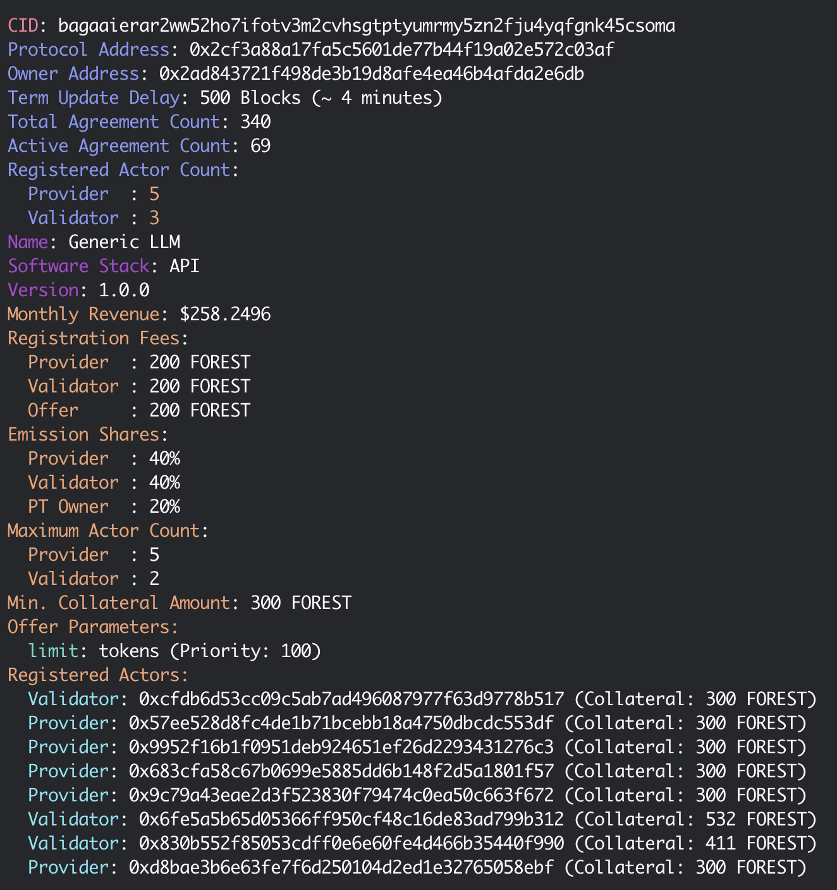

*Screenshot: CLI output showing available protocols including Generic LLM*

#### Step 2: See Top Performers in this Protocol

```bash
# View Providers in this Protocol that received highest emissions last Epoch
forest network emissions --protocol 0x2cf3a88a17fa5c5601de77b44f19a02e572c03af --providers
```

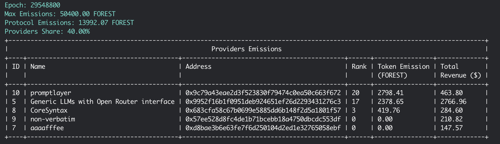

*Screenshot: CLI output showing a list of Providers with info on their Ranks and Emissions*

Seems like `promptlayer` has been the highest-scorer last epoch.

#### Step 3: See Granular Data for a Provider
If you are interested in how this Rank/Score was assigned you can view all validations that were performed on this Provider last Epoch.

```bash
# View Provider in this Protocol that received highest emissions last Epoch
forest network emissions --protocol 0x2cf3a88a17fa5c5601de77b44f19a02e572c03af --granular-data 10
```

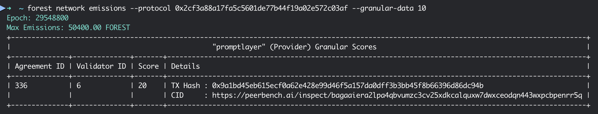

*Screenshot: CLI output showing details of all evaluations for this Provider last Epoch*

In this instance there was one validation with a score of `20`. The validation details were revealed in blockchain transaction with hash: `0x9a...c94b` and can be viewed in Peerbench under the link: https://peerbench.ai/inspect/bagaaiera2lpa4qbvumzc3cv25xdkcalquxw7dwxceodqn443wxpcbpenrr5q (explanation in the Peerbench workflow)

#### Step 4: View Available Offers

Let's assume we decided to purchase a Service from this Provider. Let's browse the offers and look for offers from our Provider with ID `10`.

```bash
# Browse available offers in the Generic LLM Protocol
forest get offer
```

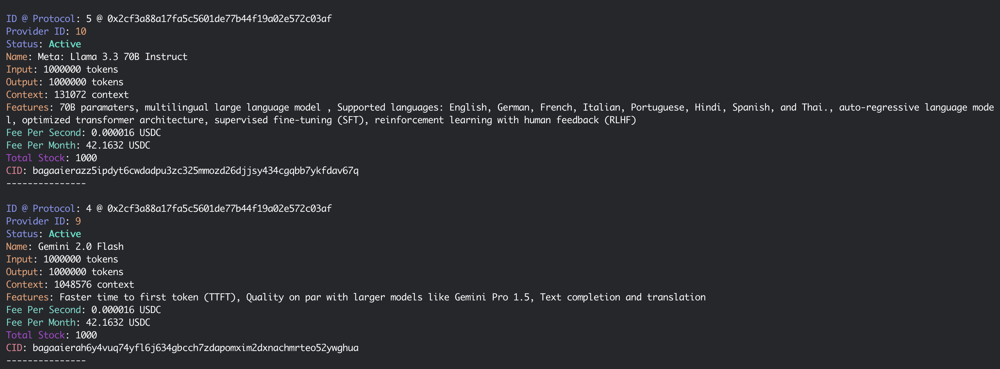

*Screenshot: CLI output showing a list of Offers in the Generic LLM Protocol*

We are interested in Offer `ID @ Protocol: 5 @ 0x2cf3a88a17fa5c5601de77b44f19a02e572c03af` because it comes from our Top-Scorer last epoch.

### Option B: Using Forest Stats Webapp

Let's try a similar workflow now using the Stats webapp.

#### Step 1: Open Forest Stats Webapp

Navigate to [https://stats.forestai.io](https://stats.forestai.io).

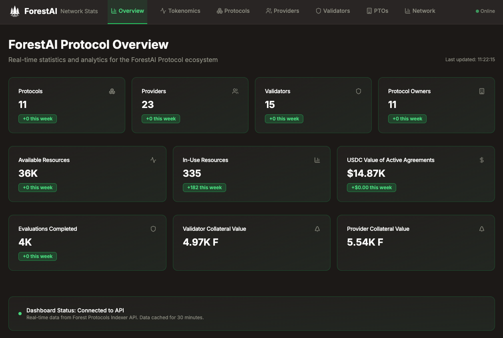

*Screenshot: Forest Stats webapp homepage*

#### Step 2: Explore Protocols

1. Click on "Protocols" in the navigation menu
2. Look for "Generic LLM" protocol in the table
3. Click on it to view details

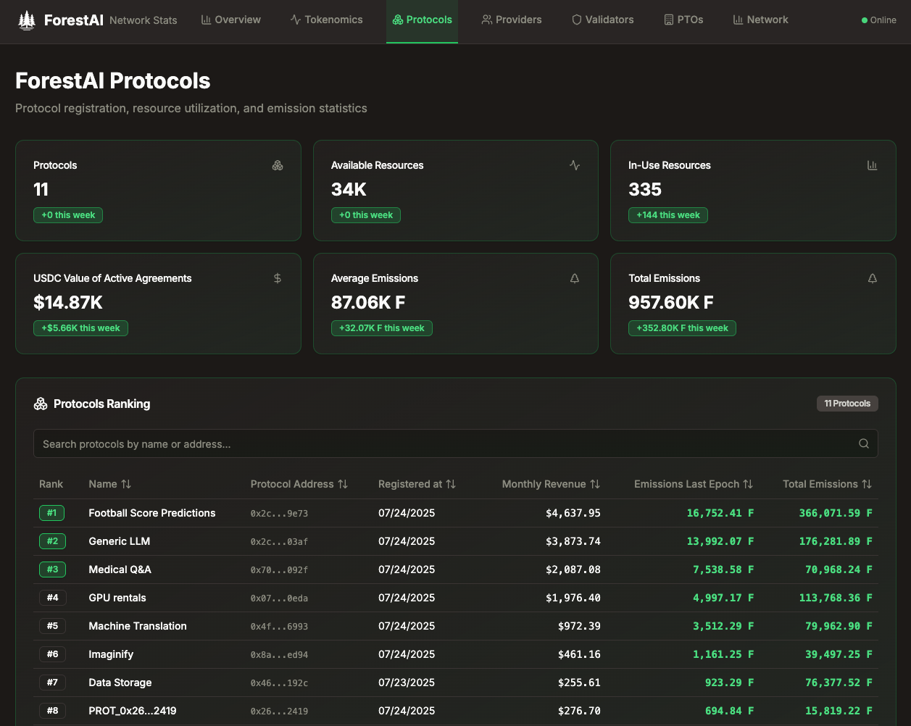

*Screenshot: List of available protocols*

#### Step 3: View Protocol Details

1. Scroll down the Offers table
2. Look for an Offer with the highest Score

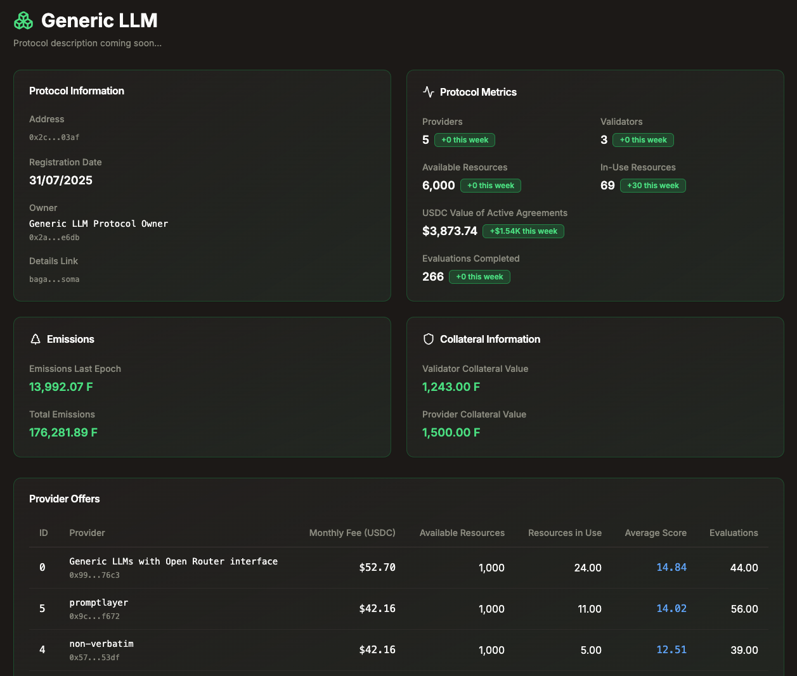

*Screenshot: Generic LLM protocol list of Offers*

> [!TIP]
> Use the validation data to compare providers before making a purchase decision. Look for consistent high performance and good uptime statistics.

For instance `promptlayer` had a higher score last epoch (which we previously saw in the CLI and is also visible below) but `Generic LLM` Provider scores better over time.

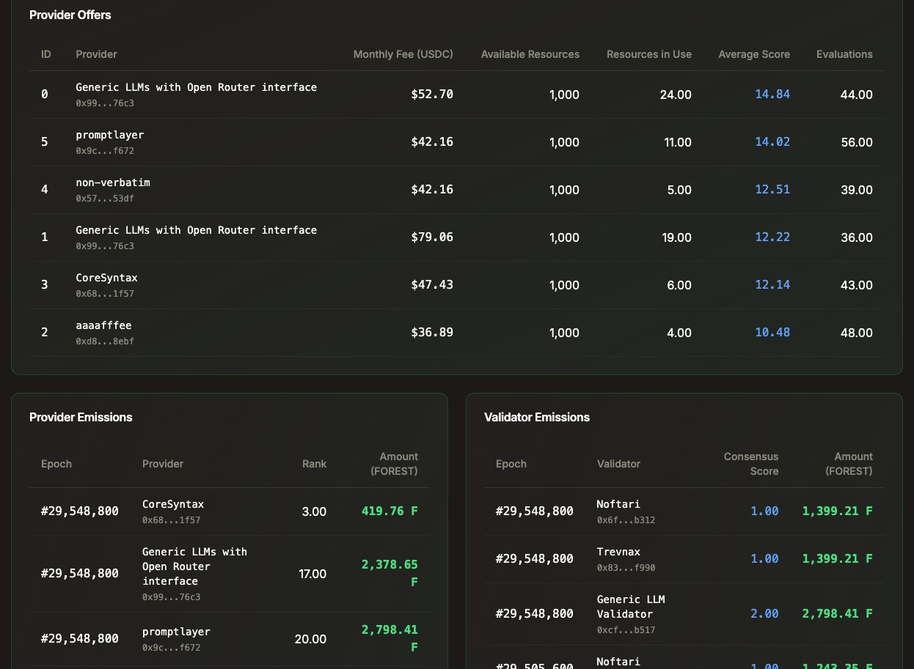

*Screenshot: Scores / Emissions from recently closed Epochs*

#### Step 4: View details of the Provider that has the top-scoring Offer

1. Click on the Provider that has the highest-scoring Offer
2. Scroll down to Recent Evaluations table

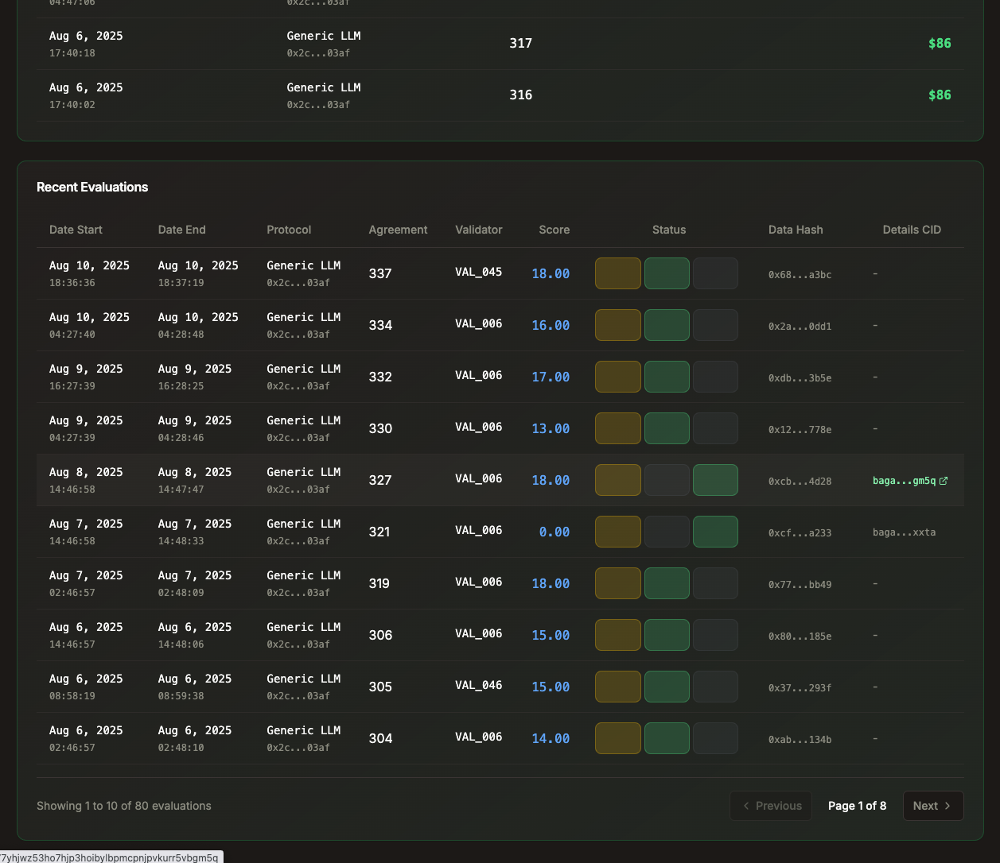

*Screenshot: Recent Evaluations performed on this Provider*

We see a list of evaluations recently performed on this Provider. There are three status boxes. Let's pick an evaluation that is fully-revealed (i.e. has the right-hand side green box highlighted). For those that are fully revealed we have links to audit files. In this example it's an evaluation that was completed with a score of `18` and the link to Peerbench points to this audit file: https://www.peerbench.ai/inspect/bagaaiera3i6e5mjpk477yhjwz53ho7hjp3hoibylbpmcpnjpvkurr5vbgm5q. More explanations in the Peerbench workflow.

## Workflow 2: View Peerbench Audit Logs 📊
As mentioned before, if you want to dig deep and explore the details of a validation (i.e. the audit log), the data is available on Peerbench. 

### Why Aren't All Validation Details Public by Default?

Public datasets are great but many of the AI model providers don't play fair and incorporate the public testsets into their training data. In this way they score high on the benchmarks but in reality these models don't generalize well. Since we want our benchmarks to be resilient to that and not get incorporated into training sets of AI models, we use a controlled revelation process for validation data. This ensures resilience against crooked providers and accoutability for the decentralized validators at the same time.

### The Three-Step Validation Publishing Process

The process of publishing validations follows three distinct phases:

1. **Commit**: Validators commit to both a score and an audit log (cryptographically sealed). 
2. **Score Reveal (aka Partial Reveal)**: Validators reveal the actual scores (mandatory for all validations).
3. **Audit Log Reveal (aka Full Reveal)**: Detailed test data is revealed (happens via random sampling).

On [https://stats.forestai.io](https://stats.forestai.io) you can see this in `Status` column in `Recent Evaluations` tables found in a couple of places. **Commit Phase** is visualised with the left-side box being highlighted in yellow. **Score Reveal** is visualised with the middle box being highlighted in green. **Audit Log Reveal** is visualised with the right-side box being highlighted in green.

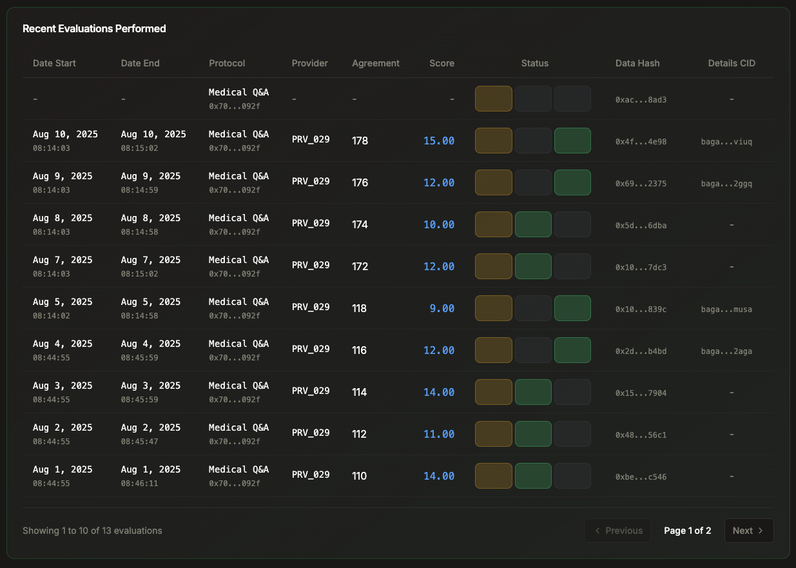

*Screenshot: Sample Evaluation at distinct publication phases*

> [!NOTE]
> **Why the multi-step process?** The commit phase ensures that validators cannot change their assessment after seeing other results. The random sampling for audit log reveals protects our test data while still providing transparency.

> [!IMPORTANT]
> **Accountability**: All validators are committed to their data. If there's any doubt about a score, validators can be challenged and forced to reveal what wasn't revealed by the protocol by default.

### Browsing Available Audit Logs

Once audit log files are revealed, you can browse them on Peerbench in two ways:
- **Direct Access**: Use links from stats.forestai.io or the CLI to view specific audit files
- **Browse Interface**: Navigate through the Peerbench frontend to explore all available logs

#### Direct Link

In our workflow examples we had two links. Let's use one of them to see how a sample Audit File looks like:
- https://www.peerbench.ai/inspect/bagaaiera3i6e5mjpk477yhjwz53ho7hjp3hoibylbpmcpnjpvkurr5vbgm5q

If we click on the link we are taken to the audit file itself. In there you can see the exact tests that were performed. 

Some audit files might include a single test but some might include a whole suite of tests:

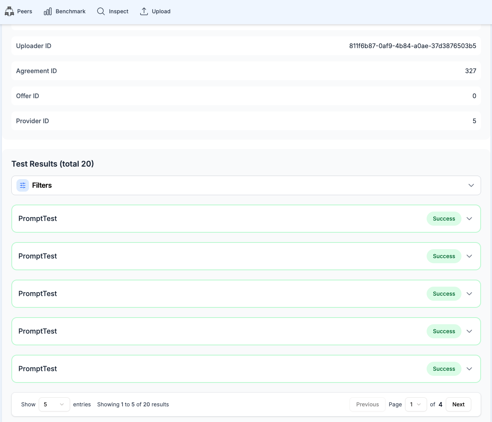

*Screenshot: Peerbench frontend showing the metadata of an audit file log and its content*

An example of test details:

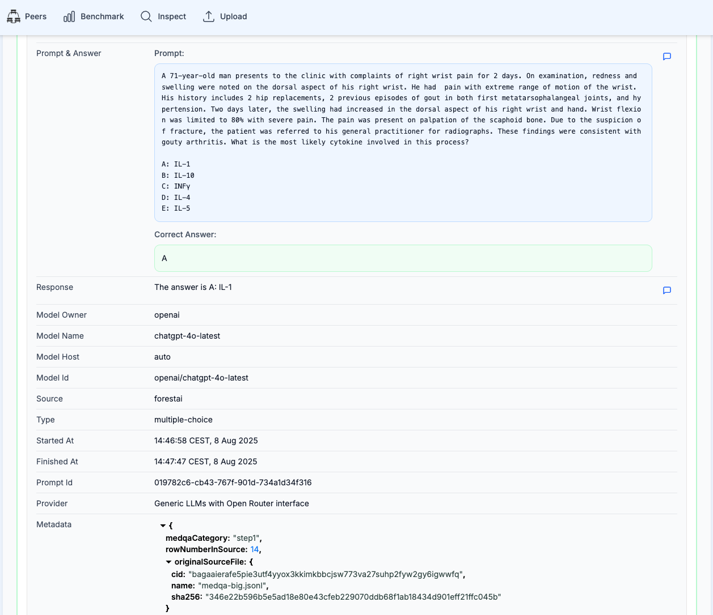

*Screenshot: Peerbench frontend showing details of the audit file log tests*

#### Browse all Audit Files using Peerbench frontend

You can always navigate to https://www.peerbench.ai/inspect to browse all inspect files that have been published so far.

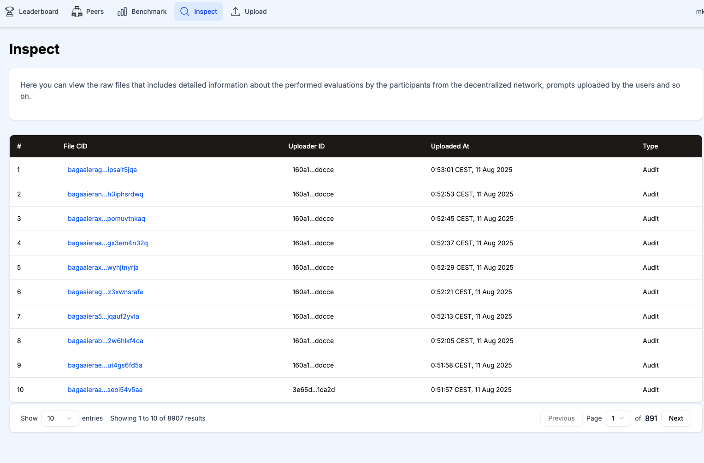

*Screenshot: Peerbench frontend showing list of all available audit file logs*

#### Browse Peerbench Rankings

Peerbench also includes its own ranking page that shows performance of different models on different datasets. This can be inspected here: https://www.peerbench.ai/leaderboard 

> [!NOTE]
> Please note that Peerbench is a framework for fair validation that is being used by many. That's why it includes data not only from ForestAI. However all ForestAI data is on Peerbench.

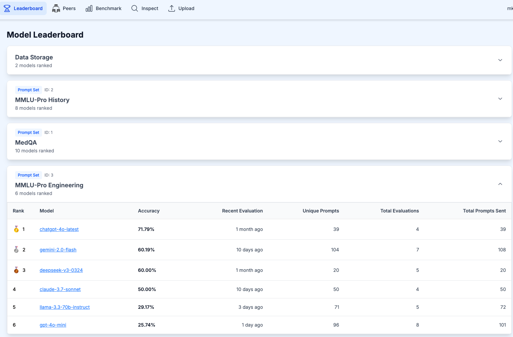

*Screenshot: Peerbench frontend showing model leaderboard on a variety of test sets*

## Workflow 3: Purchase AI Chat Services using CLI (Generic LLM Protocol) 💳

#### Step 5: Check Your Wallet Balance

> [!IMPORTANT]
> Ensure you have sufficient USDC balance before entering an agreement.

```bash
# Check your wallet balance
forest wallet balance
```

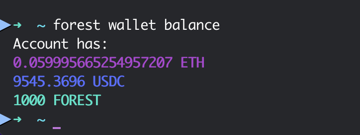

*Screenshot: CLI output showing wallet balance (ETH, USDC, and FOREST tokens)*

#### Step 6: Enter an Agreement

```bash
# Enter an agreement with a provider (offer ID 5)
forest agreement enter -o 5 -p 0x2cf3a88a17fa5c5601de77b44f19a02e572c03af
```

If the user entering the Agreement doesn't have enough allowance, the CLI will ask for a confirmation to set it and then for a confirmation on the amount of money charged for purchasing this Service.

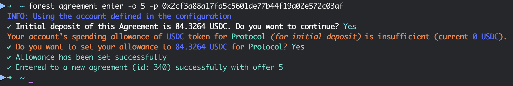

*Screenshot: CLI output showing details of the newly created agreement*

> [!IMPORTANT]
> **Save your Agreement ID**: The command above will output an agreement ID (e.g., `123`). You'll need this ID for making API calls.

### Workflow 4: Make API Calls to Your Purchased Resource using CLI (Generic LLM Protocol) 🔌

Once you have an active agreement, you can make API calls to the purchased service using the Forest CLI.

> [!IMPORTANT]
> API calls to purchased services are available through the CLI at the moment. Web interfaces are for viewing data and validation metrics. However it is planned to have a full-fledged web marketplace for purchasing, managing and using agreements in a user-friendly way.

#### Step 7: Import API Specifications

```bash
# Import OpenAPI specs for the Generic LLM Protocol
forest api import 0x9c79a43eae2d3f523830f79474c0ea50c663f672
```

You should get a confirmation saying: `Done`

#### Step 8: Make a Chat Completion Request

```bash
# Make a chat completion request using your agreement
forest api gllm chat/completions \
  --provider-id 10 \
  --body.id YOUR_AGREEMENT_ID \
  --body.pt 0x2cf3a88a17fa5c5601de77b44f19a02e572c03af \
  --operator 0x9c79a43eae2d3f523830f79474c0ea50c663f672 \
  --body.messages '[{"role": "user", "content": "Hello, how are you? Can you help me understand blockchain technology?"}]'
```

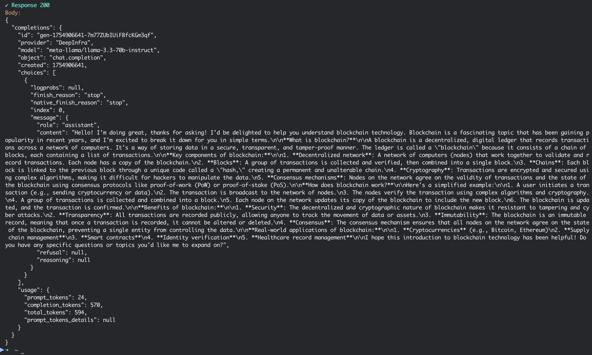

*Screenshot: Output of a Chat Completion API Call to one of the LLM Providers we made an Agreement with*

# 🎉 Thanks, If You Want to Learn More

- Discord: [link](https://discord.gg/HWm96wKzWV)
- CLI Docs: [link](/cli/README.md)
- Project Summary: [link](README.md)