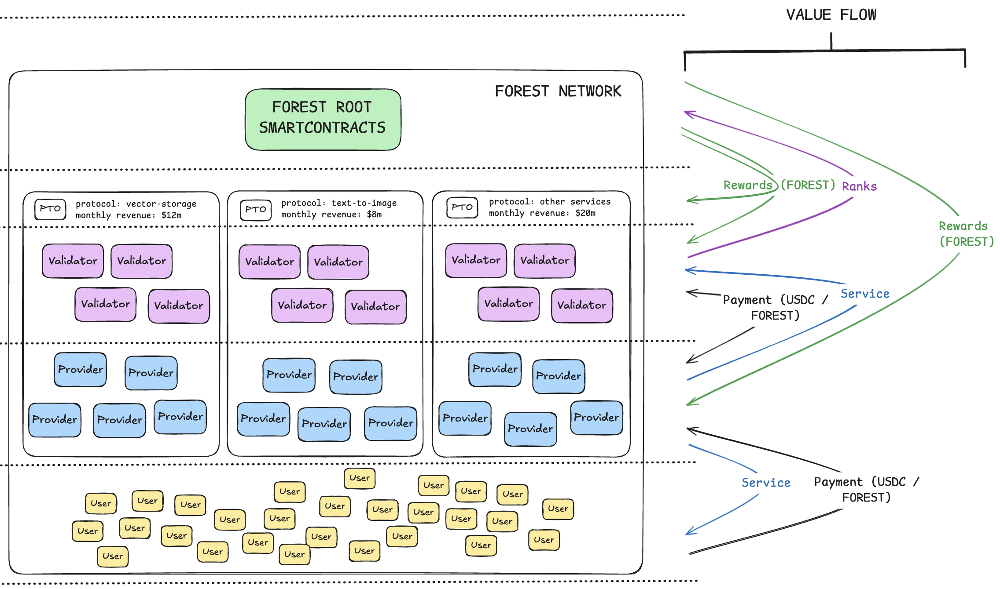

Forest AI is a **network of incentivised Protocols**, each solving a **specific AI challenge** with **Providers selling solutions to Customers** and **Validators ensuring quality** by utilizing a **novel fair validation framework.** 

# Abstract

**Forest is an AI-focused innovation market** leveraging positive learnings from **Bitcoin mining** and **preventing tokenomics pitfalls** that allow oligarchies of large token holders to control networks to their benefit **like in Bittensor**.

In Forest, **all services are available for purchase** by real-world clients on day one. This allows us to **move away from corruption-prone stake-weighted voting** and instead **distribute tokens based on verified blockchain data** on who attracts the most new customers to the network.

Furthermore we ensure fair competition by utilizing **cheat-proof decentralized AI benchmarking** in the reward function and **collateral** **slashing** for attempted cheating. 

To ensure **long-term economic viability** the network treasury **earns a commission** on revenue generated by participants.  

# Important Links

1. [Whitepaper vAlpha](/ForestAI_Whitepaper_Version_Alpha.md) - An alpha version of the whitepaper that includes both problem framing as well as solution overview.
2. [Protocols](/proposed-protocols) - The specification of AI Competitions (aka Protocols) currently being built on Forest AI. They are defined as markdown specs that include the aim, description of the unified interface of supported funcitonalities as well as rules and requirements for Providers.
3. [Contracts](/contracts) - Solidity smart contracts defining token distribution mechanism.
4. [SDK](/sdk-js) - Software Development Kit for building software that interacts with ForestAI.
5. [Provider Base Template](https://github.com/Forest-Protocols/provider-template) - Base Provider Template used by Protocol Owners to define their Protocols.
6. [Validator Base Template](https://github.com/Forest-Protocols/validator-template) - Base Validator Template used by Protocol Owners to define the validation process for their Protocol.
7. Docs:
   * [doc: Create a New Protocol](https://github.com/Forest-Protocols/provider-template/blob/main/README.md)
   * [doc: Become a Provider in a Protocol](https://github.com/Forest-Protocols/provider-template/blob/main/docs/become-a-provider.md)
   * [doc: Become a Validator in a Protocol](https://github.com/Forest-Protocols/validator-template/blob/main/docs/become-a-validator.md)
   * [doc: Best Coding Practices & Tips](https://github.com/Forest-Protocols/provider-template/blob/main/docs/best-practices-and-tips.md)
   * [doc: Sync a Repo after Base Template update](https://github.com/Forest-Protocols/provider-template/blob/main/docs/how-to-sync-repository.md)
   * [doc: Create OpenAPI for you Protocol](https://github.com/Forest-Protocols/provider-template/blob/main/docs/openapi-spec.md)
8. [FIP Discussions](https://github.com/Forest-Protocols/protocols/discussions) - A forum where Forest Improvement Proposals (FIP) are discussed.

# ForestAI in One Diagram

#  Protocols

| Name | Goal | Address | Registration | Provider Code | Validator Code |
|-|-|-|-|-|-|
| Generic LLM | AI Model: General Purpose LLM (Text-to-Text) | [0x263...81756](https://sepolia.basescan.org/address/0x263dE5ea24867C3aCFdd6D578d8f11b70Ca81756) |  ✅ | ✅ | ✅ |
| Machine Translation | AI Model: Language-to-Language | [0xb3F...7d0fe](https://sepolia.basescan.org/address/0xb3F7152Af0C1f7f791097C6E8C0AE7FD82e7d0fe) | ✅ | ✅ | 🛠️ |
| Imaginify | AI Model: Text-to-Image | [0x2Fa...E5457](https://sepolia.basescan.org/address/0x2FaebF878887B57f6faA82c7D0289654FBeE5457)  | ✅ | ✅ | 🛠️ |
| Ball Predict | AI Model: Football Fixture-to-Score | [0x592...51AC9](https://sepolia.basescan.org/address/0x592483982A67336A742947fC06E36f6d54051AC9) | ✅ | ✅ | ✅ | 
| VectorNest | AI Infra: Vector Storage | [0x7dD...50731](https://sepolia.basescan.org/address/0x7dDe884e8e0aD5883BD786801084A9ed1E650731) | ✅ | ✅ | 🛠️ | 
| AI Compute | AI Infra: High Performance GPU Rentals | [0x85e...6bAb4](https://sepolia.basescan.org/address/0x85eeb56E7ca7E70b15AC0DcA6Bb915A558C6bAb4) | ✅ | ✅ | 🛠️ |
| Event Predict | AI Model: Event-to-Outcome | [0xc14...8CD8b](https://sepolia.basescan.org/address/0xc1492B16C11CE580026c53B9F240aB082598CD8b) | ✅ | ✅ | 🛠️ |
| IPFS Storage | Cloud Infra: IPFS Pinning Serices | [0x4C4...F545b](https://sepolia.basescan.org/address/0x4C4Ab078Bd871Da161ccC8Ac8603A981183F545b) | ✅ | ✅ | 🛠️ |
| Medical Q&A | AI Model: Medicine Fine-tuned LLM (Text-to-Text) | [0xFf2...c4721](https://sepolia.basescan.org/address/0xFf24e1259450D84727FB401C8fc036ce80Ac4721) | ✅ | ✅ | ✅ |

**More in the works.**

# Vocab Cheatsheet

**Protocols**: Standardize the competition for an AI task. Define unified API for Providers and quality evaluation criteria for Validators. Protocols are created and managed by Protocol Owners.

**Protocol Owners** (aka PTO): Define protocol goals, rules, parameters and hyperparameters.

**Users** (aka Customers): Purchase AI services from Providers, influencing token rewards with their economic choices.

**Providers**: Offer best AI services to Users and compete for Rewards. 

**Validators**: Evaluate Providers' performance, ensure cross-compatibility, aggregate the results and rank all Providers in a specific Protocol to find the best innovators.

**Emissions / Rewards**: Tokens emitted to Actors for positive behaviours that progress the goals of the ForestAI Network. ForestAI rewards:

- Protocols for solving valuable challenges  
- Providers for having high performance  
- Validators for truthful and consistent completion of Provider validations

> [More Info](ForestAI_Whitepaper_Version_Alpha.md#network-actors)

# ForestAI Value Proposition

**For Protocol Owners**: PTOs get a share of reward emissions (in FOREST) and a revenue share (in USDC/FOREST) for facilited user-provider transactions within their Protocols. 

**For Providers**: Providers benefit from a new powerful distribution channel for their Services, prove their performance to the whole world and get rewards for innovating on valuable challenges if their performance is high enough. 

**For Validators**: For checking the performance and quality of provider services, Validators get rewarded in FOREST.

**For Users**: 10x better AI Cloud experience and cost reduction: access to a wide & comparable offering from competing Providers, better prices, full transparency on Provider's past performance, unified interfaces and customer protection programme which mitigates the risk for trying out unknown Providers.

> [More Info](ForestAI_Whitepaper_Version_Alpha.md#how-forestai-leverages-insights-to-drive-innovation)

# Emissions

> [More Info](ForestAI_Whitepaper_Version_Alpha.md#token-emissions)

# Tokenomics

> [More Info](ForestAI_Whitepaper_Version_Alpha.md#tokenomics)

# Detailed Info

Please refer to the **Whitepaper** for: 
>[More Info](ForestAI_Whitepaper_Version_Alpha.md)

# Join Us

- Discord: [link](https://discord.gg/HWm96wKzWV)
- X: [link](https://x.com/forest_ai_)
- Create your own Protocol: *see Important Links sections and click on Provider Base Template link*
- Become a Provider: *see Important Links sections and click on Become a Provider doc link*
- Become a Validator: *see Important Links sections and click on Become a Validator doc link*
